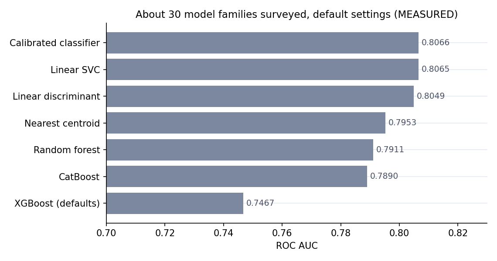
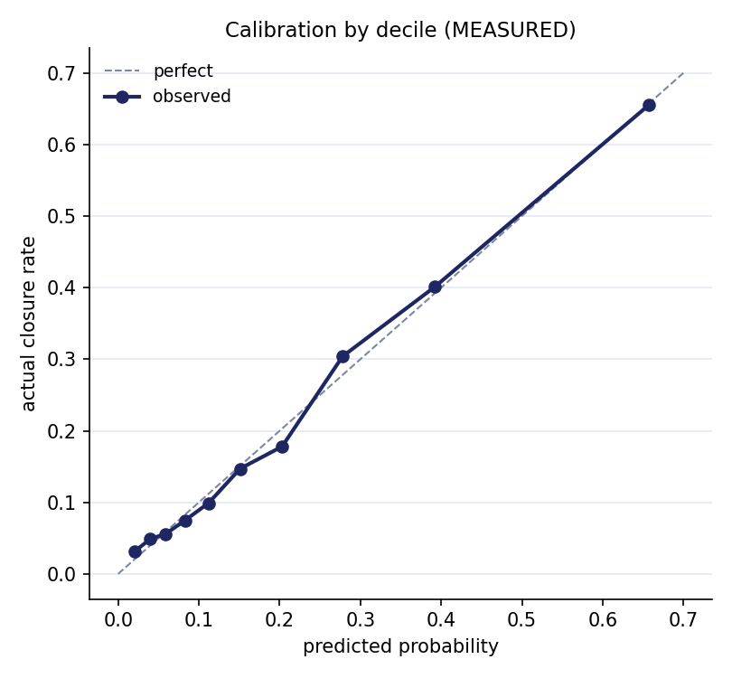
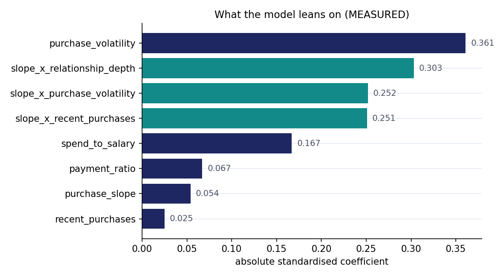

# Churn Prevention Agent

**A credit-card churn model that knows its own ceiling, wrapped in a local AI agent that decides whether a customer is worth saving — and with what.**

Built during an internship at [Sumerge](https://www.sumerge.com/) for a bank's credit-card marketing team. 8,500 real customers, Egyptian market, EGP.

---

## The problem

A bank finds out a customer closed their credit card at the one moment nothing can be done about it.

The marketing team needed two things, not one:

1. **Who is about to close**, early enough to act.
2. **Is a retention offer actually worth making** — and which one.

The second question is what makes this a business tool rather than a model. A probability with no decision attached is a number nobody uses.

> **Churn here means the customer closed their credit card** — not that they left the bank. Someone can close a card and keep a mortgage, a salary account and a deposit, and those still earn money. That distinction drives the entire value calculation.

---

## Results

| Metric | Value |
|---|---|
| **ROC AUC** | **0.8069** (5-fold CV, all 8,500 customers) |
| **F1, churn class** | **0.5509** |
| Decision threshold | 0.255 (tuned for F1, not 0.5) |
| Churners caught | 1,098 of 1,697 — **65%** |
| Chosen model | Logistic regression in a scikit-learn `Pipeline` |

Accuracy is deliberately absent. Predicting "nobody closes" scores 80% on this dataset and catches nobody.

### The simplest model won — and that was a result, not a preference

About 30 model families were surveyed, then six taken to 5-fold cross-validation.



A heavily tuned XGBoost (random search) landed at **0.8052**. An untuned logistic regression landed at **0.8002**. Deeper boosting scored *worse* than shallow — it was memorising rows. Adding interaction terms and percentile clipping to the logistic regression took it to **0.8069**, and that was the end of the leaderboard.

---

## The finding that stopped the modelling

Rather than grinding for another 0.005 AUC, the project asked whether more AUC was even available.

**Method:** regenerate the labels from the model's own predicted probabilities — a world where the model is correct by construction — and re-score against them. If real signal remained undiscovered, that score would be far higher than the observed one.

```
AUC against regenerated labels : 0.8074   (sd 0.0069 over 20 runs)
AUC actually observed          : 0.8069
```

They match. **The ceiling is ~0.807 AUC.** No algorithm gets past it, because roughly a third of the people who close look identical, in these 29 columns, to people who stay. Their reason for leaving is not in the data.

That single test closed the modelling question and moved the entire project to the decision layer — which is where the actual business value was.

Two supporting checks came to the same conclusion: **more data wouldn't help** (5× the rows bought 0.029 AUC), and **the probabilities are honest** — predicted vs actual closure rate tracks closely across all ten deciles, which matters more than AUC here because the retention decision multiplies that probability by money.



---

## Feature engineering: shapes, not columns

Six months of spending and six months of repayments are twelve raw columns a linear model can do almost nothing with. The work was turning them into shapes.

- **`purchase_slope`** — a least-squares line through the six spending months (`np.polyfit`), not "month 6 minus month 1", which throws away four months and breaks on one odd month.
- **`purchase_volatility`** — how erratic the spending is. The single strongest input in the model.
- **`payment_ratio`** — clearing the card, or carrying it.
- **`spend_to_salary`** — strain.
- **`relationship_depth`** — how many products they hold. A thin relationship is easier to walk away from.
- **Four interaction terms** — slope × depth, slope × volatility, slope × recent purchases.



**Three of the top four features are interactions.** On its own, the spending slope scores 0.054 — nearly nothing. Combined with context it scores 0.303, 0.252 and 0.251.

*The direction of spending only means something once you know who it's happening to.*

Because the final model is a logistic regression, the standardised coefficients **are** the explanation, exactly — no SHAP required, and the agent's "why" panel is arithmetic rather than approximation.

### The raw signal underneath

Closures per 100 customers, by how far card spending fell over six months:

| Spending change | Closures per 100 |
|---|---|
| Fell > 30% | **70.0** |
| Fell 20–30% | 42.0 |
| Fell 10–20% | 28.1 |
| Fell 5–10% | 19.1 |
| Roughly flat | 13.4 |
| Growing | 6.9 |

### One real bug, found and fixed

Percentile ranks were originally fitted on all 8,500 rows *before* cross-validation split them — leaking validation data into training and quietly inflating every score. Moved inside the pipeline, where it cannot be skipped at serving time. Training-serving skew solved structurally rather than by remembering.

---

## The agent

The model outputs a probability. A marketing employee cannot act on a probability.

The agent runs **entirely locally** — Ollama, `qwen3:4b` — so no customer detail leaves the building. That was a hard requirement.

```
Marketing employee describes a customer in plain English
                    │
      ┌─────────────┴─────────────┐
      │  18 of 25 fields extracted│   ← plain Python: regex, keyword matching
      │  by code, not the model   │      NOT the language model
      └─────────────┬─────────────┘
                    │
              tool.py  ──►  churn_model.pkl   (features → clip → scale → predict)
                    │
      ┌─────────────┴─────────────┐
      │  Decision 1: worth it?    │   value > cost ÷ (risk × success rate)
      │  Decision 2: which offer? │   distressed vs drifting
      └─────────────┬─────────────┘
                    │
         Streamlit: risk · why · worth · offer
```

### Decision 1 — is this customer worth an offer?

> the customer must be worth more than **cost ÷ (risk × chance the offer works)**

If someone is 40% likely to leave and the offer works 25% of the time, the offer only has a 10% chance of saving anything — so it must be worth more than ten times its cost. This stops the bank spending 500 EGP to retain someone who earns it 600 a year. Below 800 EGP/year of value, `NO_OFFER` fires first, before any offer rule is even checked.

### Decision 2 — which offer?

Two churner types, and this is the part the client engaged with most:

| Type | Signal | Needs |
|---|---|---|
| **Distressed** | High spend-to-salary, missed payments, falling slope they can't afford | Relief — payment plan, fee waiver, rate reduction |
| **Drifting** | Can afford it, thin relationship, low engagement | A reason — cashback, rewards boost, limit increase |

**Same risk score, opposite correct offer.** A hardship plan sent to a drifting customer is insulting; a rewards boost sent to a distressed one is useless. The risk model cannot tell these apart — it only outputs one number. The agent can, because it reads the *shape* of the inputs.

### The engineering lesson

Four separate bugs in the agent phase had one root cause: **a 4-billion-parameter model cannot be trusted with structure.** It put salary into the card-spending slot. It labelled spending as repayments. It stopped calling the tool once given three jobs at once.

Every fix moved the job **out of the prompt and into plain Python** — nearest-keyword matching, a comma-run regex, a yes/no word map, a three-route dispatcher. Result: **18 of 25 fields are extracted with no model involvement.** The LLM is used for what it's good at — talking — and nothing else.

### Two things the agent will not do

- **Leak internals.** Asked how accurate it is, it says only that it was tested on thousands of the bank's own customers — never AUC, F1, threshold or algorithm. Added after an earlier version leaked the AUC into a chat reply.
- **Pretend low scores are safe.** Every assessment carries the warning that about a third of customers who close look identical to customers who stay.

---

## Repo map

```
├── agent/                    the agent — 4 files, no framework
│   ├── agent.py              conversation, extraction, routing
│   ├── tool.py               scoring, value, churner type
│   ├── offers.py             8 offers + NO_OFFER, plain if/else
│   ├── churn_features.py     pipeline classes — DO NOT EDIT
│   └── chat.py               Streamlit window, zero logic
├── notebooks/                phases 1–3, 115 cells
├── models/churn_model.pkl    the full pipeline, 821 KB
├── data/schema/              SCHEMA ONLY — no real client data
├── evaluation/               metrics, coefficients, plots
├── prompts/                  every prompt, extracted
├── docs/                     experiment log, offer framework, UI notes,
│                             decision log, code guide, slide deck
└── PROJECT_SUMMARY.md        the full technical write-up
```

**No real bank data is in this repository.** `data/schema/` holds the column schema and five *invented* customers with `SYNTH-` ids. Raw and processed CSVs are gitignored and were verified absent before publishing.

---

## Run it

```bash
python -m venv venv
venv\Scripts\activate          # Windows
pip install -r requirements.txt
ollama pull qwen3:4b
streamlit run agent/chat.py
```

scikit-learn is **pinned to 1.6.1**. The pickle was built with that version; loading it under another produces an `InconsistentVersionWarning` and, in the worst case, silently different numbers.

---

## What this does not do

Stated plainly, because a model you can't criticise is a model you don't understand.

- **It predicts who will leave, not who can be saved.** Those are different questions. The right technique for the second is uplift modelling, which needs a control group — some at-risk customers who deliberately get no offer. That experiment was never run. **This is the honest headline limitation.**
- **The money figures are placeholders.** Four rates and the offer costs are marked stand-ins in the code. Every EGP figure is directionally useful, numerically provisional.
- **Offer success rates (40% / 25%) are assumptions** with nothing behind them — and they drive the break-even rule directly.
- **About a third of churners are invisible.** Proven, not suspected.
- **One dataset, one point in time.** No drift monitoring, no retraining schedule.
- **The threshold is tuned for F1, not money.** F1 treats a missed churner and a false alarm as equally bad. They are not.
- **Not deployed, not load-tested, no automated tests.** One machine, one conversation at a time.

---

## Context

Internship project at Sumerge Egypt, 2026. Dataset supplied by the client bank under NDA and is not included here.

Development was AI-assisted; the modelling strategy, feature design, the ceiling test, the value and offer framework, and every architecture decision are documented with their reasoning in [`PROJECT_SUMMARY.md`](PROJECT_SUMMARY.md) and [`docs/EXPERIMENT_LOG.md`](docs/EXPERIMENT_LOG.md), including the ideas that were tested and rejected.

## License

MIT — see [LICENSE](LICENSE).
